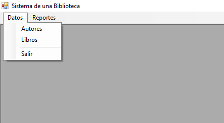
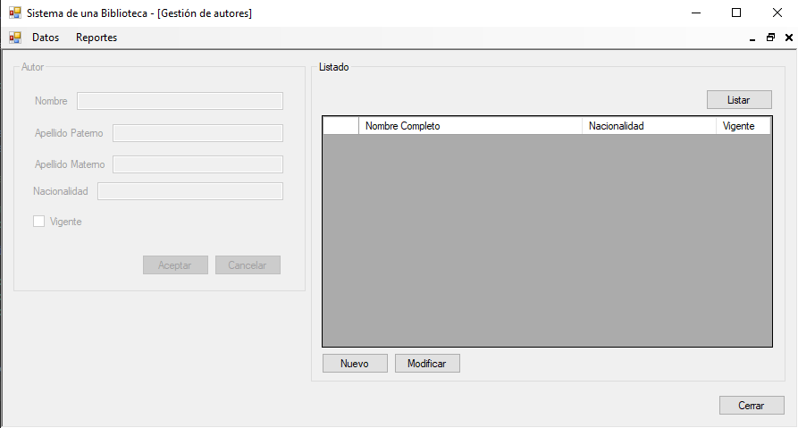
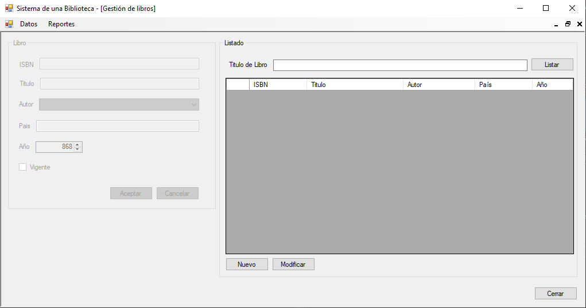
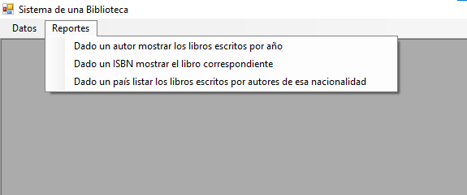
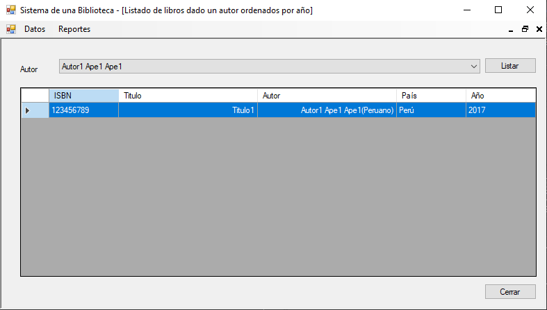
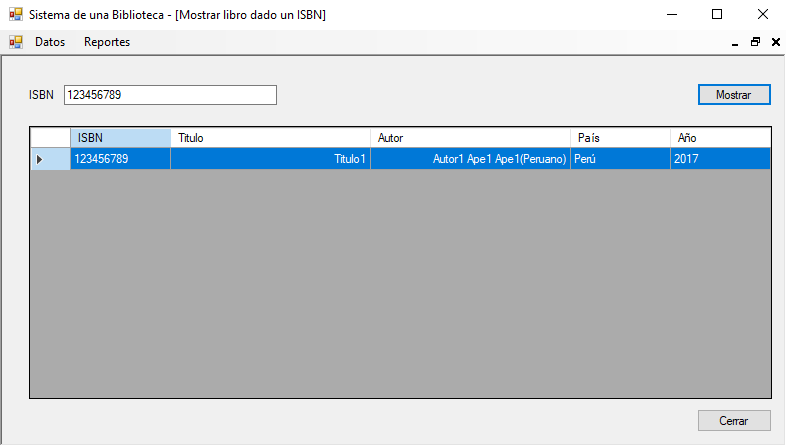
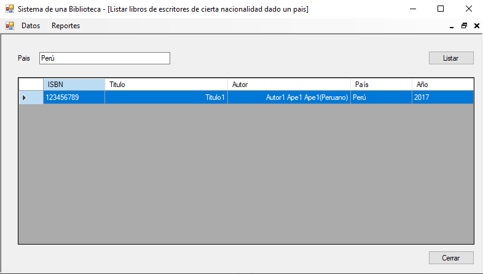

# Gestión de libros
Sistema de gestión de libros en una librería donde podemos gestionar autores que permite registrar, modificar y listar autores, también gestionar libros que permite registrar, modificar y listar libros, en los reportes tenemos listado de libros ordenados por año según el autor,  mostrar un libro según su ISBN y listado de libros según un país de autores con esa nacionalidad, **18/10/20**

<strong>Imagen:</strong> Menú de datos.

<strong>Imagen:</strong> Gestión de autores.

<strong>Imagen:</strong> Gestión de libros.

<strong>Imagen:</strong> Menú de reportes.

<strong>Imagen:</strong> Dado un autor mostrar los libros escritos por año.

<strong>Imagen:</strong> Dado un ISBN mostrar el libro correspondiente.

<strong>Imagen:</strong> Dado un país listar los libros escritos por autores de esa nacionalidad.

